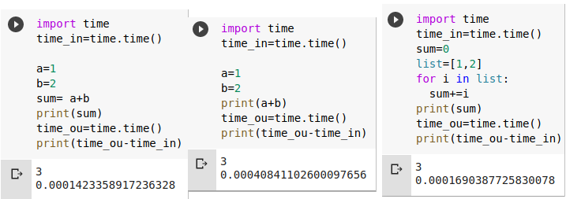
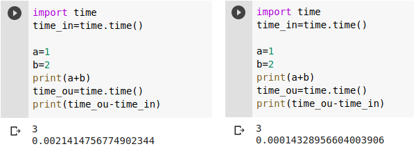
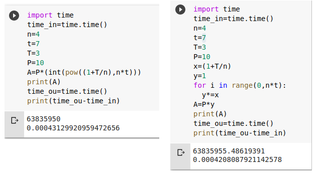
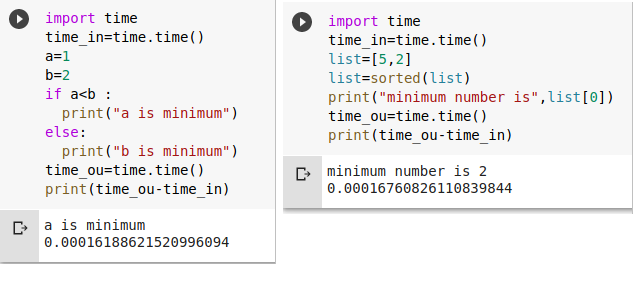

# 1. Sum of two numbers A and B 

-------

**Method-1** :

* Start                        
* declare a,b,sum                     
* Add a,b and store in sum         
* End 

### Time Complexity : 

**sum=a+b takes one constant time for arthmetic operation and one constant time for storing**

>**T(n)=2 implies O(1)**

**Method-2** :

* Start
* declare list=[1,2]
* intiate for loop 
* add elements in list and store in sum  
* End 

### Time Complexity : 
**sum+=i takes two constant times and for loop runs 2 times ( Here n is fixed i.e, 2 )**

>T(n)= 2x2=4  implies **O(1)**

Time complexity is constant in all methods 

## Observation:

1. If we use inbuilt functions in the code then time complexity changes .
2. If we try to calculate the real time taken to execute the program using "time" library , it gives differnt times for same program because of usage of inbuilt function.

# 2. Celsius(C) to Fahrenheit(F)

---------------

**Algorithm**:

* Start
* get the value of C
* Calculate F using formua 
* End

### Time Complexity:

**F=(9*C/5)+32 takes one constant time for addition,multiplication,division each and one constant time for storing**

>T(n)=4 implies **O(1)**

Time complexity will reamin same when Fahrenheit(F) is converted to Fahrenheit(F).

# 3. Area(A) and Perimeter(P) of square 

-------

**Algorithm**:

* Start
* get the length of square
* Calculate Area = l*l
* Calculate Perimeter = 4*l
* End

### Time Complexity:

**A=lxl takes one constant time for arthematic operation , storing data each and P=4xl takes one constant time for arthematic operation , storing data each**

>T(n)=4 implies **O(1)**

# 4. Finding Compound Interest

------

**Algorithm**:

* Start
* get the values of P,T,t,n
* calculate A=P*(1+T/n)^(n * t)
* End

### Time Complexity:

**A=P*(1+T/n)^nt takes one constant time for addition , division, multiplication twice ,storing data each and logn time for pow inbuilt function ,if we use for loop instead of pow() inbuilt function then the time complexity will be O(1) because n*t value is fixed here implies for loop runs for n*t constant times**

>T(n)=5+logn implies **O(logn)**

We can observe the time taken is same in both the cases.

# 5. Swap Two numbers using Temporary Variable

------

**Algorithm**:

* Start
* initialize a,b,c
* swaping :
         * c=a 
         * a=b
         * b=c
* End 

### Time Complexity:

**For Storing data in temporary variable it takes one constant time**

>T(n)=1 implies **O(1)**

# 6. Smallest of two numbers A and B 

-------

**Method-1:**

* Start
* declare a,b
* compare a,b if a is less than b then print a is minimun
* else print b is minimum
* End

### Time Complexity:
**"a<b" takes one constant time**

>T(n)=1 implies **O(1)**

**Method-2:**

* Start
* declare a list which contains a and b
* use inbuit function sorted to sort the list
* print the first element of sorted list
* End

### Time Complexity:

**Here we can't say sorted function takes constant time because sorted function algorithm is different**
But the time taken is almost same.

# 7. Largest of Three numbers A,B and C 

-------

**Algorithm**:

* Start
* declare a,b and c 
* compare a,b if a is greater than b is TRUE
        * compare a,c if a is greater than c then print a is minimun
        * else print c is minimun 
* else:
        * compare b,c if b is greater than c then print b is minimun
        * else print c is minimun 
* End

    **OR**

* Start 
* declare a list which contains a,b,c
* use inbuit function sorted to sort the list
* print the last number 
* End 

### Time Complexity:

**3 comparisions requires 3 constant times**

>T(n)=3 implies **O(1)**

But for second method time complexity is not constant because of the sorted inbuilt function.

# 8. Even numbers in between 0 to 50 

------

**Alogorithm**:

* Start
* intialize for loop for i in range(0,50)
* if i%2==0 then print
* End 
 
### Time Complexity:
**i%2==0 takes 2 constant time and for loop runs 50 times**

>T(n)=2*50 implies **O(1)** but if loop runs n times then time complexity will be O(n)

# 9. Sum of series 1+2+3+4+....N 

------

**Alogorithm**:

* Start
* declare sum=0
* initialize for loop for i in range (1,N+1)
* sum+=i 
* print sum
* End 

**sum+=i takes one constant time for arthematic operation,storing data each and for loop runs n times**

>T(n)=2n implies **O(n)**

